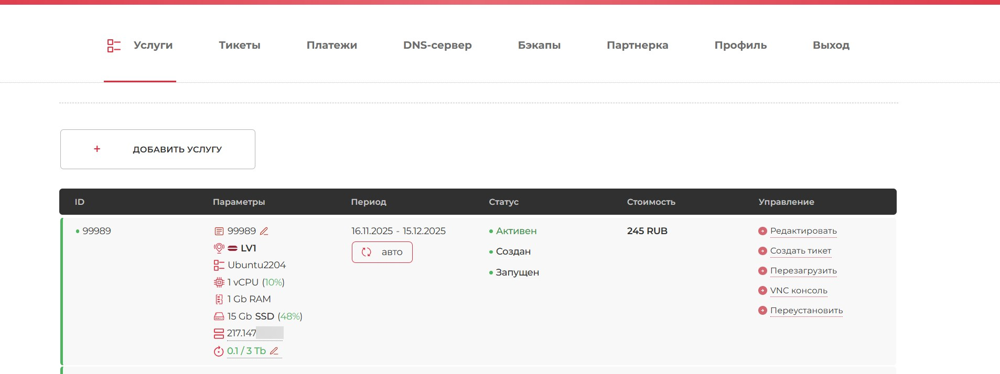
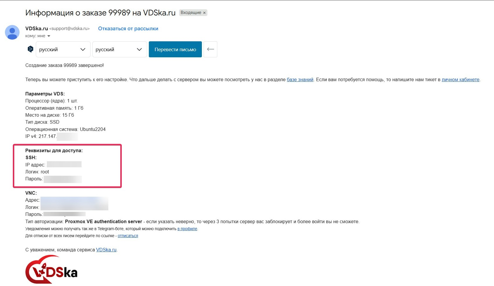
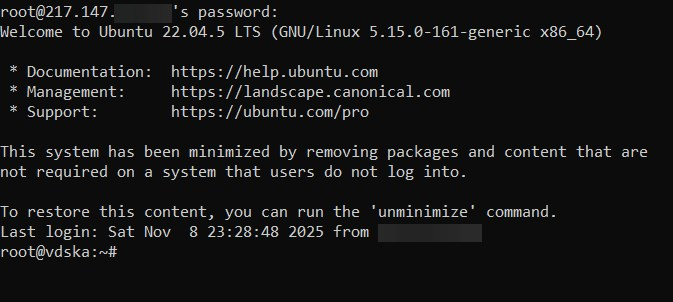
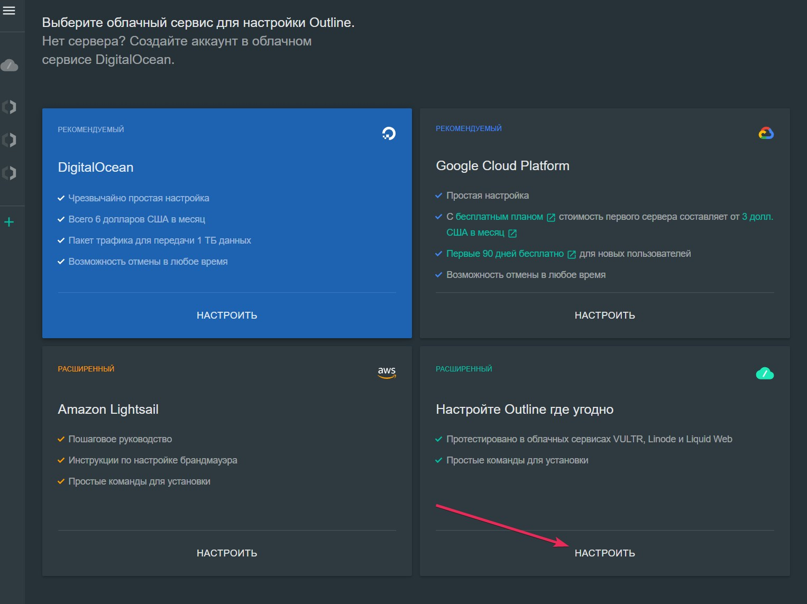
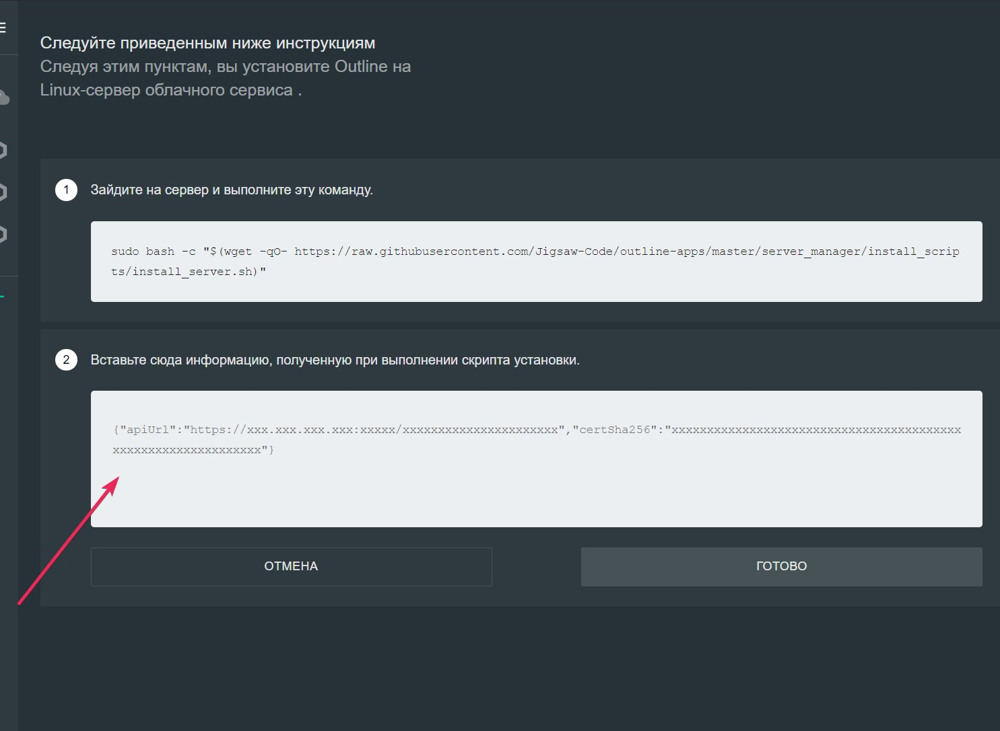
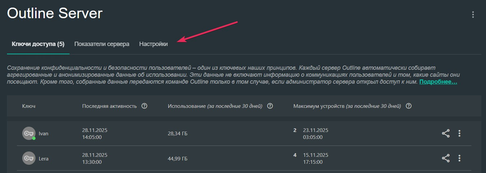
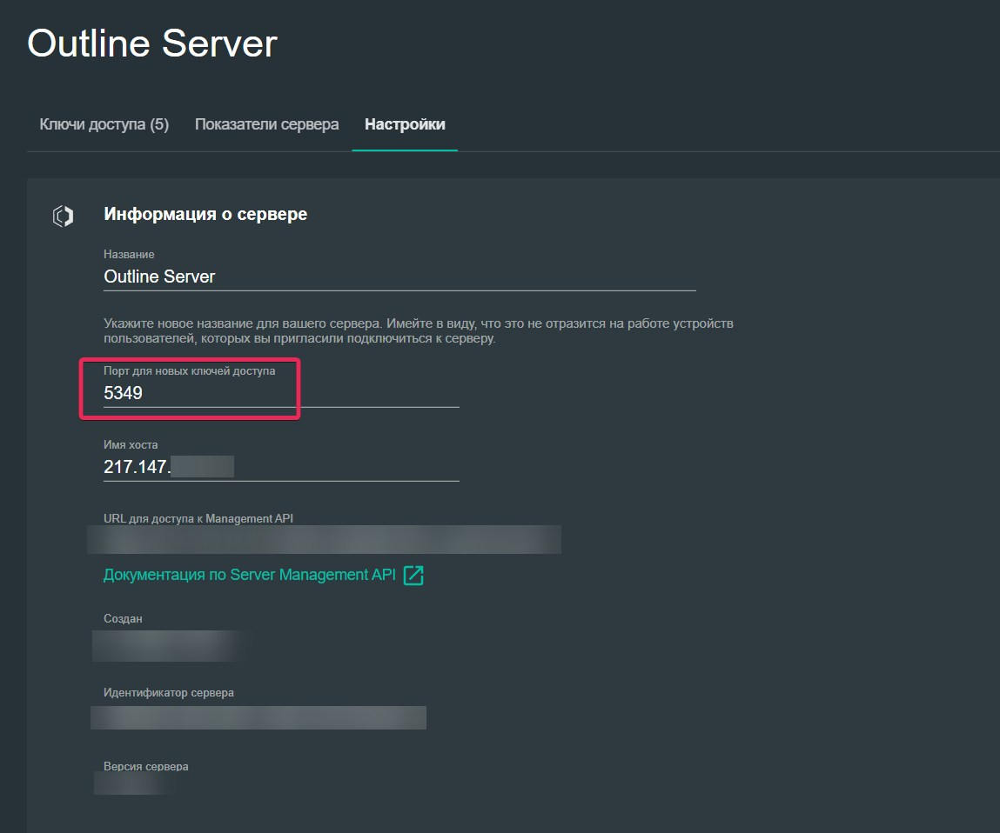
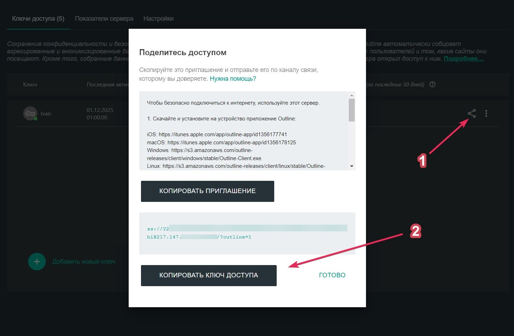

# Инструкция по настройке сервера VPN на Outline
1. Выбор сервера.
   Я использую сервер от [https://vdska.ru/](https://vdska.ru/). Там можно посмотреть тарифы и выбрать подходящую локацию.
   *Инструкцию буду писать по серверу от вдски , но вы можете выбрать любой другой.*

   Для сервера предназначенного для впн достаточно брать минимальный тариф на 15-20 ГБ SSD, 1 ядро, 1 ГБ ОП. Операционную систему выбираем Linux Ubuntu 22.04. (Оптимальные локации на данный момент, которые я использую, это Латвия и Германия (польша в скорости сильно упала, как и финляндия с нидерландами, но всё может от региона зависеть)).

   Итак, шаги:

   1. Зарегистрироваться на сайте, купить сервер (Можете брать на неделю для теста если хотите, или на месяц сразу. В поддержке можно будет сменить локацию, если будет плохо работать).
   2. После в лк на вкладке "услуги", у вас появится ваша услуга. Оплачиваем если ещё не сделали. После сервер начнёт настраиваться и запускаться (обновите через пару минут страницу)
   3. После настройки и запуска сервера, он будет у вас примерно так отображаться (скрин 1). В боковом меню услуги можете его перезагружать, включать если выключен был, и прочее.
      
   4. На вашу почту вам придёт письмо с доступом к серверу. Будем использовать данные для подключения по SSH (скрин 2)
      
2. Теперь переходим к настройке сервера.

   1. На Windows используем power shell ибо с ним проще (на маках терминал или что там у вас есть :D).
   2. Открываем его (от администратора) и пытаемся подключиться к серверу, используем данные команды:

      1. `ssh логин@ваш_ip_адрес_сервера`  (полная команда выглядит так  `ssh root@217.199.99.999`) ( `root` это стандартный логин, IP адрес берём из письма, прошлый скрин 2)
      2. Вводим пароль от сервера (также скрин 2). При вводе пароля, вы не будете видеть символы что печатаете. Просто по символу введите пароль вручную или скопируйте и вставьте через правую кнопку мыши.
      3. Когда вы успешно подключитесь, появится инфа о вашем сервере (скрин 3)
        
   3. Теперь настройка сервера. Вводите команды по очереди, по одной строчке за раз. Если появится запрос на подтверждение, то подтверждайте, вводите соответствующую букву (Y/y):

```
sudo apt update && sudo apt upgrade -y //обновляем все пакеты

sudo apt install ufw -y //устанавливаем файервол

sudo ufw allow ssh //добавляем порты в исключения

sudo ufw enable // включаем если не включился сам

sudo apt install curl 

sudo bash -c "$(wget -qO- https://raw.githubusercontent.com/Jigsaw-Code/outline-server/master/src/server_manager/install_scripts/install_server.sh)" 
//командой выше мы получим ключ для подключения к нашему менеджеру outline. Он будет выделен зелёным.


//Не закрываем пока что Power Shell
```

1. Теперь настройка Outline Manager:

   1. [Скачиваем](https://developers.google.com/outline/docs/download-links?hl=ru) и устанавливаем Outline Manager.
   2. Нажимаем на добавление сервера (скрин 4)
      
   3. Вставляем ключ, который мы получили ранее по команде выше (зелёный) (скрин 5 куда вставлять)
      
   4. После чего вы увидите меню вашего сервера. Там вы можете добавлять ключи, менять их название, смотреть сколько трафика сожрали и т.п.
   5. Сейчас нас там интересует пункт "Настройки". Заходим, и в поле "Порт для новых ключей доступа" вписываем порт 5349 (скрин 6, 7)
      
      
   6. После этого возвращаемся на вкладку "Ключи доступа" и удаляем все имеющиеся там ключи через меню (3 точки справа от них)
   7. Создаём необходимое количество ключей через кнопку "Добавить новый ключ" и именуем каждый, чтобы в будущем не запутаться (Создавайте их по схеме 1 ключ = 1 человек. Ключ можно использовать как на компьютере, так и на телефоне, поэтому создавать несколько на 1 человека смысла нет)
   8. Почти последний пункт. Чтобы поделиться ключом, нажимаем на значок "поделиться" (возле 3 точек находится) (скрин 8)
      
   9. И финальный шаг. Берём скопированный ключ `ss://Y2hhY2hhMXXXXXXXXXXXXXXXXXXXXXXXXXX@217.147.XX.XXX:5349/?outline=1`, и добавляем к его концу префикс для маскировки трафика `&prefix=%16%03%01%00%C2%A8%01%01`.
      То есть итоговый вариант рабочего ключа = ключ + префикс:

      ```
      ss://Y2hhY2hhMXXXXXXXXXXXXXXXXXXXXXXXXXX@217.147.XX.XXX:5349/?outline=1&prefix=%16%03%01%00%C2%A8%01%01
      ```

Всё, теперь такой ключ можно использовать. **Единственное условие для *телефона* — ключ нужно использовать через приложение Outline, чтобы впн работал и на мобильном интернете.**

Ссылка на клиент Outline — [здесь](https://developers.google.com/outline/docs/download-links?hl=ru)

## Немного ответов на вопросы

1. **Почему на телефоне нужно использовать только Outline, а не приложения по типу Potatso и V2Box.**
   Потому наш префикс что мы добавляли в финальном шаге для маскировки трафика, будет работать только в оф. приложении Outline, в иных же приложениях, этот префикс просто игнорируется.
2. **Какие есть варианты портов и префиксов, если вдруг указанный в инструкции не работает?**
    Все варианты можно найти тут — https://developers.google.com/outline/docs/guides/service-providers/prefixing?hl=ru (используем столбец "кодировка URL")
3. **Есть ли приложения удобные для компьютера кроме Outline?***
   Советую использовать приложение Shadowsocks (оно есть для [Windows](https://github.com/shadowsocks/shadowsocks-windows/releases) и для [macOS](https://github.com/shadowsocks/ShadowsocksX-NG/releases/)). Там можно забиндить горячие клавиши для включения/выключения и переключения режима "впн на все сеть или только на определенные сайты". Если нужна будет помощь в установке или настройке, напишите.
   
   

